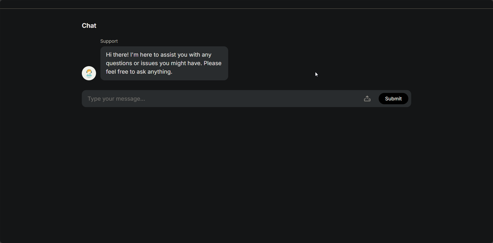
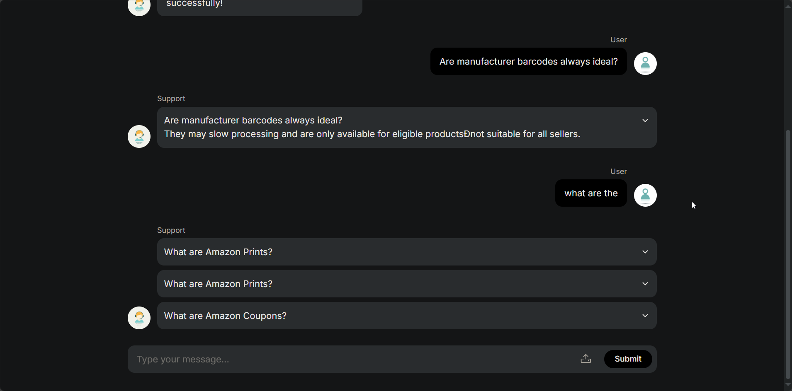

# FAQChatBot — RAG-powered FAQ assistant

A lightweight Flask app that indexes your FAQ documents with FAISS and answers questions using a Gemini LLM via Retrieval-Augmented Generation (RAG).

---

## Badges

[](https://www.python.org/)
[](https://flask.palletsprojects.com/)
[](LICENSE)

---

## Table of Contents

- [Demo](#demo)
- [Features](#features)
- [Installation / Setup](#installation--setup)
- [Usage](#usage)
- [Configuration / Options](#configuration--options)
- [Contributing](#contributing)
- [License](#license)
- [Acknowledgements / Credits](#acknowledgements--credits)

---

## Demo

Real assets from `./demo/`:





<video src="./demo/demo.mp4" width="640" height="360" controls>
  Your browser does not support the video tag.
</video>

---

## Features

- **RAG pipeline**: Builds a FAISS vector index over your docs and queries it for relevant chunks.
- **Embeddings**: Uses `sentence-transformers` to embed text (`all-MiniLM-L6-v2` by default).
- **LLM integration**: Calls Google Gemini via `google-generativeai` with a strict answer format.
- **File ingestion**: Load `.pdf`, `.docx`, and `.txt` via the API.
- **Index persistence**: Save, load, and clear FAISS indices.
- **Simple UI**: Minimal Flask + Jinja template to chat and manage the index.

---

## Installation / Setup

```bash
# Create a virtual environment
python -m venv .venv

# Activate it
# On Linux/Mac:
source .venv/bin/activate
# On Windows:
.venv\Scripts\activate

# Install dependencies
pip install -r requirements.txt
```

Set your Gemini API key (required by `google-generativeai`). You can use the provided `.env` file path `keys.env` or set it in your shell environment.

Create `keys.env` in the project root (already present in repo):

```
GEMINI_API_KEY=your_api_key_here
```

---

## Usage

Start the server:

```bash
python app.py
```

By default runs with `debug=True` and serves the UI at `http://127.0.0.1:5000/`.

### Web UI

- Open the home page at `/` to chat with the bot.
- Use the controls to upload a document and build the FAISS index.

### REST API Endpoints (from `app.py`)

- `POST /ask`
  - Body (JSON): `{ "message": "Your question here" }`
  - Returns: `{ "response": <string or JSON list depending on LLM output> }`

- `POST /load_faiss`
  - Multipart `file` upload (`.txt`, `.pdf`, `.docx`).
  - Uses `IOManager` to read content, chunks via `chunk_text`, and adds to FAISS.

- `POST /save_faiss_index`
  - Body (JSON): `{ "path": "path/to/index" }`
  - Persists the FAISS index and associated texts.

- `POST /load_faiss_index`
  - Body (JSON): `{ "path": "path/to/index" }`
  - Loads a previously saved index.

- `POST /clear_faiss_index`
  - Clears the in-memory FAISS index and text store.

---

## Configuration / Options

Main configuration lives in `config.py`:

- `GeneralCfg.text_embedding_model_name`: sentence-transformer model (`"all-MiniLM-L6-v2"`).
- `GeneralCfg.llm_api_model_name`: Gemini model name (default `"gemini-2.0-flash"`).
- `GeneralCfg.n_char`, `GeneralCfg.overlap`: chunk size and overlap for `chunk_text()`.
- `GeneralCfg.top_k`, `GeneralCfg.n_answers`: retrieval and answer limits.

LLM Prompt template is in `LLMPrompts.FAQ_answer_prompt` and enforces JSON-only answers when the user asks a relevant question.

Environment variables in `keys.env`:
- `GEMINI_API_KEY`: required for Gemini.

---

## Contributing

- Fork the repo and create a feature branch.
- Write clear commit messages and add tests where reasonable.
- Open a PR with a concise description and screenshots or logs when applicable.

---

## License

This project is licensed under the MIT License — see [LICENSE](./LICENSE) for details.

---

## Acknowledgements / Credits

- FAISS by Facebook AI Research.
- Sentence Transformers by UKPLab.
- Flask and Werkzeug by the Pallets team.
- Google Generative AI for Gemini models.
